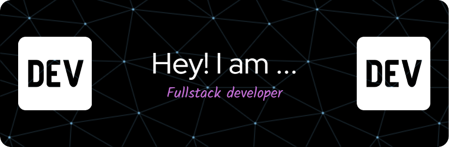

# 👋 Hi, I'm PiyBasak!

<!-- Optional: Add your custom banner -->

🎯 **Software Developer | FSE**  
🌟 **Open Source Enthusiast | Lifelong Learner**

---

### 👨‍💻 **About Me**
- 🔭 Currently working on **[Your Current Project/Area of Focus]**  
- 🌱 Learning **[Skills or Topics You’re Exploring]**  
- 💬 Ask me about **[Your Expertise or Passion]**  
- 🌍 Exploring **[Tech, Design, or Global Interests]**  

---

### 💼 **My Tech Stack**

  

  

---

### 🔗 **Links**
  
  

---

### 📊 **GitHub Stats**
  

---

### 🌟 **Featured Projects**
- [**Project Name**](https://github.com/YourUsername/ProjectRepo)  
  _Description of the project and its significance._  
    

- [**Another Cool Project**](https://github.com/YourUsername/AnotherProject)  
  _Another brief description._  
  

---

✨ _Feel free to explore my repositories and connect with me!_  
